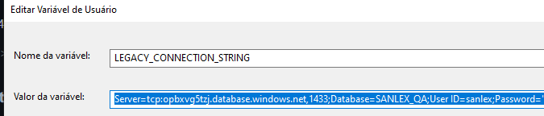
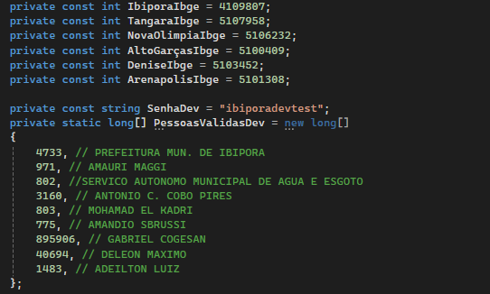
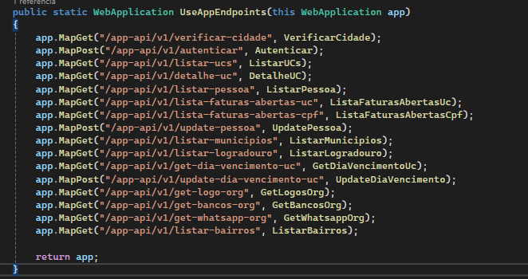

# Antedimento Águas

# Instalação

1. Instale NodeJS direto do site oficial [node.js](https://nodejs.org/en/)
2. Instale o Expo após instalar NodeJS

   ```jsx
   npm install --global expo-cli
   ```
3. Instale as dependencias após clonar o projeto em: https://github.com/cogesan/gis-mobile2

   ```jsx
   npm install
   ```
4. Inicie o projeto

   ```jsx
   npx expo start
   ```

#### Utilização da API localmente

* Utilizar API rodando localmente para fazer o desenvolvimento;
* Clonar o Projeto em: https://github.com/cogesan/gis-web.git;
* Atualmente existe uma branch especifica para o desenvolvimento da API, branch: multi-tenant;
* Necessário para rodar o projeto: Visual Studio, .NET 8).

#### Váriaveis de ambiente

* Definir uma váriavel de ambiente para utilizar banco de testes, nome da váriavel: LEGACY_CONNECTION_STRING com o valor de algum banco QA.
* Exemplo:
* 
* Após seguir todos os passos execute o projeto.

#### Endpoints

* No arquivo AppExtensions.cs estão os Endpoints utilizados no App;
* No inicio temos uma lista dos Municipios com permissão de acesso ao App, o valor adicionado redere - se ao código IBGE, Adicione e exclua conforme necessário;
* Logo após temos uma lista de pessoas com permissão de acesso com a senha de Desenvolvimento: ibiporadevtest, Adicione e exclua conforme necessário;
* 
* Endpoints e seus respectivos retornos.
* 

#### Requisições no Aplicativo
